# Project "Quizzes" | Проєкт "Quizzes"

## __Purpose of the Project__ | __Мета створення проєкту__

The goal of the project is to reinforce knowledge after the AI intensive and practice with CSS and HTML.<br> <br>Ціль проєкту — закріпити знання після інтенсиву з штучного інтелекту та попрактикуватися з CSS і HTML.

## __Plan-navigation for README__ | __План-навігація по README__
* [Purpose of the Project | Мета створення проєкту](#purpose-of-the-project--мета-створення-проєкту)<br>
* [Team members | Склад команди](#team-members--склад-команди)<br>
* [Project structure | Структура проєкту](#project-structure--структура-проєкту)<br>
* [Project design | Дизайн проєкту](#project-design--дизайн-проєкту)<br>
* [Explanation of application specifications | Пояснення специфікації застосунків](#explanation-of-application-specifications--пояснення-специфікації-застосунків)<br>
* [Project installation guide | Інструкція до встановлення проєкту](#project-installation-guide--інструкція-до-встановлення-проєкту)<br>
* [Сonclusion | Висновок](#conclusion--висновок)<br>

## __Team members__ | __Склад команди__
[Дмитро Печенюк](https://github.com/DmitriyPechenyuk0) - Тім лід  
[Віктор Горюнов](https://github.com/iv1teq)  
[Тимофій Рассоленко](https://github.com/TimofeyRas)  
[Никита Годований](https://github.com/Nikita-Hodovanyj)  
[Кирило Харлан](https://github.com/KirillKharlan)   
[Артем Власов](https://github.com/ArtemVlasov2009)  

## __Project structure__ | __Структура проєкту__

```mermaid
flowchart TB
CORE["Quizzes"] --> NEW["New_Quiz_App"]
NEW --> ST["static"]

ST --> CSS["css"]
CSS --> CSS_NEW_APP["New_Quiz_App.css"]
CSS --> CSS_NEW_APP_STUDENT["New_Quiz_App_Student.css"]
CSS --> CSS_NEW_APP_STUDENT2["New_Quiz_App_Student_2.css"]
CSS --> CSS_NEW_SETTINGS["New_Quiz_Settings.css"]
CSS --> CSS_ERROR403["error_403.css"]
CSS --> CSS_JOIN["join.css"]
CSS --> CSS_JOIN_NEXT["join_next.css"]

ST --> JS["js"]
JS --> JS_NEW_APP["New_Quiz_App.js"]
JS --> JS_NEW_SETTINGS["New_Quiz_Settings.js"]
JS --> JS_JOINNEXT["joinnext.js"]
JS --> JS_JQUERY["jquery-3.7.1.min.js"]

ST --> QUIZ_DATA["quiz_data"]
ST --> UPLOADS["uploads"]

NEW --> TP["templates"]
TP --> TPL_NEW_APP["New_Quiz_App.html"]
TP --> TPL_NEW_APP_STUDENT["New_Quiz_App_Student.html"]
TP --> TPL_NEW_APP_STUDENT2["New_Quiz_App_Student_2.html"]
TP --> TPL_NEW_SETTINGS["New_Quiz_Settings.html"]
TP --> TPL_ERROR403["error_403.html"]
TP --> TPL_JOIN_NEXT["join_next.html"]

NEW --> DSS[".DS_Store"]
NEW --> INIT["__init__.py"]
NEW --> APP["app.py"]
NEW --> MOD["models.py"]
NEW --> VIW["views.py"]

CORE --> AUTH["authorization.py"]
AUTH --> AUTH_STATIC["static/css"]
AUTH_STATIC --> AUTH_CSS["authorization.css"]

AUTH --> AUTH_TEMPLATES["templates"]
AUTH_TEMPLATES --> AUTH_HTML["authorization.html"]

AUTH --> AUTH_INIT["__init__.py"]
AUTH --> AUTH_APP["app.py"]
AUTH --> AUTH_VIEWS["views.py"]

CORE --> HIS["history"]
HIS --> HIS_STATIC["static"]
HIS_STATIC --> HIS_CSS["css"]
HIS_CSS --> CSS_HISTORY["history.css"]
HIS_CSS --> CSS_QSR["quiz_student_result.css"]
HIS_CSS --> CSS_QTR["quiz_teacher_result.css"]

HIS --> HIS_TEMPLATES["templates"]
HIS_TEMPLATES --> TPL_HISTORY["history.html"]
HIS_TEMPLATES --> TPL_QSR["quiz_student_result.html"]
HIS_TEMPLATES --> TPL_QTR["quiz_teacher_result.html"]

HIS --> HIS_INIT["__init__.py"]
HIS --> HIS_APP["app.py"]
HIS --> HIS_VIEWS["views.py"]

CORE --> HOME["home_app"]
HOME --> HOME_STATIC["static"]
HOME_STATIC --> HOME_CSS["css"]
HOME_CSS --> CSS_HOME["home.css"]
HOME_STATIC --> HOME_JS["js"]
HOME_JS --> JS_HOME["home.js"]

HOME --> HOME_TEMPLATES["templates"]
HOME_TEMPLATES --> TPL_HOME["home.html"]

HOME --> HOME_INIT["__init__.py"]
HOME --> HOME_APP["app.py"]
HOME --> HOME_VIEWS["views.py"]

CORE --> MED["media"]

CORE --> MIG["migrations"]
MIG --> MIG_VERSIONS["versions"]
MIG_VERSIONS --> MIG_FILE["3c6dcd8ecab8_.py"]
MIG --> MIG_README["README"]
MIG --> MIG_ALEMBIC["alembic.ini"]
MIG --> MIG_ENV["env.py"]
MIG --> MIG_SCRIPT["script.py.mako"]

CORE --> PROF["profile_app"]
PROF --> PROF_STATIC["static"]
PROF_STATIC --> PROF_CSS["css"]
PROF_CSS --> CSS_PROFILE["profile.css"]
PROF_STATIC --> PROF_JS["js"]
PROF_JS --> JS_PROFILE["profile.js"]

PROF --> PROF_TEMPLATES["templates"]
PROF_TEMPLATES --> TPL_PROFILE["profile.html"]

PROF --> PROF_INIT["__init__.py"]
PROF --> PROF_APP["app.py"]
PROF --> PROF_MODELS["models.py"]
PROF --> PROF_VIEWS["views.py"]

CORE --> PROJ["project"]
PROJ --> PROJ_STATIC["static"]
PROJ_STATIC --> PROJ_CSS["css"]
PROJ_CSS --> CSS_BASE["base.css"]

PROJ_STATIC --> PROJ_JS["js"]
PROJ_JS --> JS_BASE["base.js"]
PROJ_JS --> JS_PARTICLES["particles.js"]

PROJ_STATIC --> PROJ_FONTS["fonts"]
PROJ_FONTS --> FONT_QB["Quicksand-Bold.ttf"]
PROJ_FONTS --> FONT_QL["Quicksand-Light.ttf"]
PROJ_FONTS --> FONT_QM["Quicksand-Medium.ttf"]
PROJ_FONTS --> FONT_QR["Quicksand-Regular.ttf"]
PROJ_FONTS --> FONT_QS["Quicksand-SemiBold.ttf"]
PROJ_FONTS --> FONT_ROBOTO["Roboto-Regular.ttf"]

PROJ --> PROJ_TEMPLATES["templates"]
PROJ_TEMPLATES --> TPL_BASE["base.html"]

PROJ --> PROJ_INIT["__init__.py"] 
PROJ --> PROJ_DB["data.db"] 
PROJ --> PROJ_LOGIN["login_manager.py"] 
PROJ --> PROJ_SETTINGS["settings.py"] 
PROJ --> PROJ_URLS["urls.py"] 

CORE --> QUI["quiz_app"]
QUI --> QUI_STATIC_JS["static/js"]
QUI_STATIC_JS --> JS_JOIN["join.js"]
QUI_STATIC_JS --> JS_TEACHER["teacher_room.js"]

QUI --> QUI_TEMPLATES["templates"]
QUI_TEMPLATES --> TPL_JOIN["join.html"]
QUI_TEMPLATES --> TPL_TEACHER["teacher_room.html"]

QUI --> QUI_INIT["__init__.py"]
QUI --> QUI_APP["app.py"]
QUI --> QUI_MODELS["models.py"]
QUI --> QUI_SOCKETS["sockets.py"]
QUI --> QUI_VIEWS["views.py"]

CORE --> REG["registration"]
REG --> STAT_CSS["static/css"]
STAT_CSS --> REGCSS["registration.css"]

REG --> TMPL["templates"]
TMPL --> REGHTML["registration.html"]

REG --> INITPY["__init__.py"]
REG --> APPPY["app.py"]
REG --> VIEWSPY["views.py"]


CORE --> DS[".DS_Store"]
CORE --> GIT[".gitignore"]
CORE --> RM["README.md"]
CORE --> MAN["manage.py"]
CORE --> REQ["requirements.txt"]



```



## __Project design__ | __Дизайн проєкту__

https://www.figma.com/design/YzImPm9jOsLFq1Hr3ium2P/Quizzes?node-id=0-1&p=f

## __Explanation of application specifications.__ | __Пояснення специфікації застосунків__

<details>
  <summary><strong>New_Quiz_App</strong></summary>

  ---
  #### EN
  > __New_Quiz_App__ – application for creating new tests
  ---
  #### UA
  > __New_Quiz_App__ – додаток для створення нових тестів
  ---
</details>

<details>
  <summary><strong>auth/reg</strong></summary>

  ---
  #### EN
  > __auth/reg__ – Application for registration and login to account
  ---
  #### UA
  > __auth/reg__ – Додаток для реєстрації та входу до облікового запису
  ---
</details>

<details>
  <summary><strong>history</strong></summary>

  ---
  #### EN
  > __history__ – application for viewing test history
  ---
  #### UA
  > __history__ – додаток для перегляду історії тестів
  ---

</details>

<details>
  <summary><strong>home_app</strong></summary>

  ---
  #### EN
  > __home_app__ – This app is responsible for displaying and configuring the homepage.
  ---
  #### UA
  > __home_app__ – цей застосунок відповідає за відображення та налаштування головної сторінки.
  ---
</details>

<details>
  <summary><strong>profile_app</strong></summary>

  ---
  #### EN
  > __profile_app__ – This app is responsible for account creation, authentication, and logout. 
  ---
  #### UA
  > __profile_app__ – цей застосунок відповідає за створення акаунта, авторизацію, а також вихід із нього. 
  ---
</details>


<details>
  <summary><strong>project</strong></summary>

  ---
  #### EN
  > __project__ – The main application of the project, for setting up the project
  ---
  #### UA
  > __project__ - Основний додаток проекту, за налаштування проекту
  ---

</details>

<details>
  <summary><strong>quiz_app</strong></summary>

  ---
  #### EN
  > __quiz_app__ – the main application, in which all manipulations with tests are carried out, their creation, modification and configuration
  ---
  #### UA
  > __quiz_app__ – основний додаток, в ньому проводяться всі маніпуляції з тестами їх створення зміна та налаштування
  ---
</details>

## __Project installation guide__ | __Інструкція до встановлення проєкту__

> [!NOTE]
> The installation guide for Linux is intended for Ubuntu. The installation process may differ for other Linux distributions.
> 
> Інструкція з установлення для Linux призначена для Ubuntu. Процес встановлення може відрізнятися в інших дистрибутивах Linux.
<details>
  <summary><strong>For Linux</strong></summary>
  
  #### EN
  
  * **Step 1**: Open terminal

  * **Step 2**: Update the packages 
  ```sh
  sudo apt update
  ```

  * **Step 3**: Install Python 
  ```sh
  sudo apt install python3
  ```  

  * **Step 4**: Install pip (package manager for Python)
  ```sh
  sudo apt install python3-pip
  ```

  * **Step 5**: Install Git
  ```sh
  sudo apt install git
  ```

  * **Step 6**: Install VSCode:
  ```sh
  sudo apt install software-properties-common && sudo add-apt-repository "deb [arch=amd64] https://packages.microsoft.com/repos/vscode stable main" && curl https://packages.microsoft.com/keys/microsoft.asc | gpg --dearmor > /usr/share/keyrings/microsoft-archive-keyring.gpg && sudo apt update && sudo apt install code
  ```

  * **Step 7**: Open Visual Studio Code, select the folder where you want to run the project through the navigation menu `File -> Open Folder`.

  * **Step 8**: Use the shortcut <kbd>Ctrl</kbd> + <kbd>~</kbd> to open the terminal menu and select 'Git Bash'.

  * **Step 9**: Copy the command below into the Git terminal:
  ```sh
    git clone https://github.com/DmitriyPechenyuk0/Quizzes.git
  ```

  * **Step 10**:Copy and run:
  ```sh

  cd Quizzes && python3 -m venv Quizzes/venv && source Quizzes/venv/bin/activate && cd ../.. && pip3 install -r requirements.txt && python3 QRLogic/manage.py runserver
  ```

---

  #### UA

  * **Крок 1**: Відкрити термінал
  * **Крок 2**: Оновити пакети
  ```sh
  sudo apt update
  ```
  * **Крок 3**: Встановити Python
  ```sh
  sudo apt install python3
  ```  
  * **Крок 4**: Встановити pip (пакетний менеджер у Python)
  ```sh
  sudo apt install python3-pip
  ```
  * **Крок 5**: Встановити Git
  ```sh
  sudo apt install git
  ```
  * **Крок 6**: Встановити VSCode
  ```sh
  sudo apt install software-properties-common && sudo add-apt-repository "deb [arch=amd64] https://packages.microsoft.com/repos/vscode stable main" && curl https://packages.microsoft.com/keys/microsoft.asc | gpg --dearmor > /usr/share/keyrings/microsoft-archive-keyring.gpg && sudo apt update && sudo apt install code
  ```

  * **Крок 7**: Відкрийте Visual Studio Code, виберіть папку, в якій хочете запустити проєкт, через навігаційне меню `File -> Open Folder`.

  * **Крок 8**: Скористайтеся комбінацією клавіш <kbd>Ctrl</kbd> + <kbd>~</kbd>, щоб відкрити меню терміналів, і виберіть "Git Bash".

  * **Крок 9**: Скопіюйте команду у Git-термінал:
  ```sh
  git clone https://github.com/DmitriyPechenyuk0/QRLogic.git
  ```

  * **Крок 10**: Створіть новий термінал Power Shell і виконайте:
  ```sh
  python3 -m venv QRLogic/venv && cd QRLogic/venv/bin && source activate && cd ../.. && pip3 install -r requirements.txt && python3 QRLogic/manage.py runserver
  ```

</details>
<details>
  <summary><strong>For Windows</strong></summary>

  #### EN

  * **Step 1**: Download and install Python: Go to the official website [python.org](https://www.python.org/) and download the latest version of Python for your operating system. Make sure to check the 'Add Python to PATH' option during the installation.

  * **Step 2**: Download and install Git: Go to the official website [git-scm.com](https://git-scm.com/) and download the latest version of Git for your operating system.

  * **Step 3**: Install Visual Studio Code from the official website: [https://code.visualstudio.com/](https://code.visualstudio.com/)

  * **Step 4**: Open Visual Studio Code, select the folder where you want to run the project through the navigation menu `File -> Open Folder`.

  * **Step 5**: Use the shortcut <kbd>Ctrl</kbd> + <kbd>~</kbd> to open the terminal menu and select 'Git Bash'.

  * **Step 6**: Copy the command below into the Git terminal:
    ```sh
    git clone https://github.com/DmitriyPechenyuk0/QRLogic.git
    ```

  * **Step 7**: Create a new Command Prompt terminal, then copy and run:
    ```sh
    python -m venv QRLogic/venv && cd QRLogic/venv/Scripts && activate.bat && cd ../.. && pip install -r requirements.txt && python QRLogic/manage.py runserver
    ```

  ---

  #### UA

  * **Крок 1**: Завантажте та встановіть Python: Перейдіть на офіційний сайт [python.org](https://www.python.org/) і завантажте останню версію Python для вашої операційної системи. Під час встановлення обов’язково відзначте опцію "Add Python to PATH".

  * **Крок 2**: Завантажте та встановіть Git: Перейдіть на офіційний сайт [git-scm.com](https://git-scm.com/) і завантажте останню версію Git для вашої операційної системи.

  * **Крок 3**: Встановіть Visual Studio Code з офіційного сайту: [https://code.visualstudio.com/](https://code.visualstudio.com/)

  * **Крок 4**: Відкрийте Visual Studio Code, виберіть папку, в якій хочете запустити проєкт, через навігаційне меню `File -> Open Folder`.

  * **Крок 5**: Скористайтеся комбінацією клавіш <kbd>Ctrl</kbd> + <kbd>~</kbd>, щоб відкрити меню терміналів, і виберіть "Git Bash".

  * **Крок 6**: Скопіюйте команду у Git-термінал:
    ```sh
    git clone https://github.com/DmitriyPechenyuk0/QRLogic.git
    ```

  * **Крок 7**: Створіть новий термінал Command Prompt і виконайте:
    ```sh
    python -m venv QRLogic/venv && cd QRLogic/venv/Scripts && activate.bat && cd ../.. && pip install -r requirements.txt && python QRLogic/manage.py runserver
    ```
</details>

## __Conclusion__ | __Висновок__

### UA

Висновки

Цей проєкт став для нас важливим етапом у вивченні веб-розробки та практичному застосуванні сучасних інструментів. У процесі роботи ми створили сайт із тестами, що генеруються за допомогою нейромережі, а також розробили сторінку авторизації з власним CSS-дизайном.

Ми отримали досвід:
 • у створенні та оформленні користувацького інтерфейсу (CSS, робота з версткою);
 • у написанні README-файлу для документування проєкту, що дозволяє іншим розробникам швидко ознайомитися з його структурою та можливостями;
 • у застосуванні генеративних моделей для формування динамічного контенту (тестів).

Проєкт показав, як можна поєднати технічну реалізацію з документацією, а також дав розуміння принципів побудови простих освітніх сервісів.

⸻

Труднощі розробки

Під час реалізації проєкту виникли деякі труднощі:
 • робота з CSS вимагала додаткових знань для створення адаптивного й сучасного дизайну;
 • інтеграція генерації тестів через нейромережу потребувала глибшого розуміння API та механізмів обробки даних.

Ці проблеми уповільнили розробку, але водночас стали корисним досвідом, адже дозволили краще розібратися в роботі зі стилями та інтеграцією штучного інтелекту.

⸻

Подальші перспективи проєкту

У майбутньому планується:
 • оптимізувати процес генерації тестів для більшої точності та різноманітності;
 • додати особистий кабінет користувача з історією результатів;
 • реалізувати адаптивний дизайн для мобільних пристроїв;
 • інтегрувати додаткові можливості, наприклад рейтинги чи гейміфікацію.

Розвиток у цьому напрямку дозволить перетворити проєкт на повноцінний освітній веб-сервіс.

---

### EN

Conclusions

This project was an important stage for us in learning web development and practical application of modern tools. During the work, we created a website with tests generated using a neural network, and also developed an authorization page with our own CSS design.

We gained experience in:
• creating and designing a user interface (CSS, working with layout);
• writing a README file to document the project, which allows other developers to quickly familiarize themselves with its structure and capabilities;
• using generative models to generate dynamic content (tests).

The project showed how to combine technical implementation with documentation, and also provided an understanding of the principles of building simple educational services.

⸻

Development difficulties

Some difficulties arose during the project implementation:
• working with CSS required additional knowledge to create an adaptive and modern design;
• integrating test generation via a neural network required a deeper understanding of the API and data processing mechanisms.

These problems slowed down the development, but at the same time became a useful experience, as they allowed us to better understand working with styles and integrating artificial intelligence.

⸻

Further prospects of the project

In the future, it is planned to:
• optimize the test generation process for greater accuracy and diversity;
• add a personal user account with a history of results;
• implement adaptive design for mobile devices;
• integrate additional features, such as ratings or gamification.

Development in this direction will allow the project to be transformed into a full-fledged educational web service.
